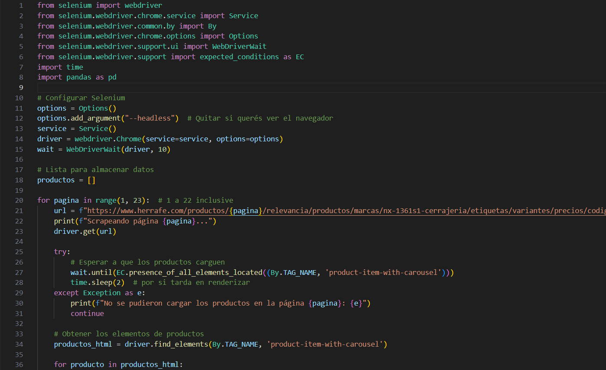

# 🔍 Herrafe Web Scraping Automation

This repository contains a **web scraping project** developed in **Python with Selenium**, aimed at collecting product data from the [Herrafe website](https://www.herrafe.com.ar). The scraped information includes:

- 🛠️ Product names  
- 🔗 Product URLs  
- 🖼️ Product image URLs  

The data is merged and saved into a final **Excel spreadsheet**, which is intended to be used in the development of a locksmith application.

---

## 📁 Project Structure

- 📂 **Herrafe_Webscraping**
  - 📄 [`webscraping_product_urls.py`](webscraping_product_urls.py) → Collects product page URLs  
  - 📄 [`webscraping_image_urls.py`](webscraping_image_urls.py) → Extracts image URLs from product pages  
  - 📓 [`merge_and_export_final_file.ipynb`](merge_and_export_final_file.ipynb) → Merges and exports final Excel file  
  - 🖼️ [`code_preview.png`](code_preview.png) → Screenshot for README  
  - 📄 [`README.md`](README.md) → Project documentation
---

## ⚠️ Special Considerations

While scraping product URLs, we encountered a small number of cases (less than 3%) where the URL elements could not be accessed using our Selenium method.  
To maintain scraping efficiency, we **decided to skip those exceptions using an `if` block**, focusing on a **page-by-page scraping approach**.

---

## 💡 Technologies Used

- 🐍 Python  
- 🌐 Selenium  
- 📊 Pandas  
- 🧪 Jupyter Notebook  
- 📄 Excel (.xlsx)

---

## ⚙️ How It Works

1. The script `webscraping_product_urls.py` navigates Herrafe's categories and extracts all product page URLs (except a few special cases intentionally skipped).
2. Then, `webscraping_image_urls.py` visits each product page and collects the product name and image URL.
3. Finally, a Jupyter notebook merges both datasets and exports the final Excel file.

---

## 📷 Preview

---

## 🤝 Contribution

This script was created as part of a locksmith tool development process.  
Feel free to fork, modify, and use for similar scraping tasks 🚀

---

## 📬 Contact

Made with ❤️ by Leonel Toro  
📧 [leonel.toro93@gmail.com](mailto:leonel.toro93@gmail.com)

---

---

# 🔍 Automatización de Web Scraping de Herrafe

Este repositorio contiene un proyecto de **web scraping** desarrollado en **Python con Selenium**, destinado a recolectar datos de productos del sitio [Herrafe](https://www.herrafe.com.ar). La información recolectada incluye:

- 🛠️ Nombres de productos  
- 🔗 URLs de productos  
- 🖼️ URLs de imágenes de productos  

Los datos son consolidados y exportados a un **archivo Excel**, pensado para ser utilizado en el desarrollo de una aplicación de cerrajería.

---

## 📁 Estructura del Proyecto

- 📂 **Herrafe_Webscraping**
  - 📄 [`webscraping_product_urls.py`](webscraping_product_urls.py) → Extrae URLs de páginas de producto 
  - 📄 [`webscraping_image_urls.py`](webscraping_image_urls.py) → Extrae nombres e imagenes de cada producto    
  - 📓 [`merge_and_export_final_file.ipynb`](merge_and_export_final_file.ipynb) → Une los datos y exporta a Excel  
  - 🖼️ [`code_preview.png`](code_preview.png) → Captura de pantalla del código  
  - 📄 [`README.md`](README.md) → Documentación del proyecto                                               

---

## ⚠️ Consideraciones Especiales

Durante el scraping de URLs de productos, se detectaron algunos casos (menos del 3%) donde los elementos no podían ser clickeados con la lógica utilizada en Selenium.  
Para hacer más eficiente el scraping, **decidimos ignorar esos casos mediante un bloque `if`**, utilizando un enfoque de scraping **página por página**.

---

## 💡 Tecnologías Usadas

- 🐍 Python  
- 🌐 Selenium  
- 📊 Pandas  
- 🧪 Jupyter Notebook  
- 📄 Excel (.xlsx)

---

## ⚙️ Cómo Funciona

1. El script `webscraping_product_urls.py` navega por las categorías del sitio y extrae las URLs de las páginas de producto (exceptuando algunos casos especiales ignorados a propósito).
2. Luego, `webscraping_image_urls.py` recorre cada una de esas URLs y recolecta el nombre del producto y la URL de su imagen.
3. Finalmente, un notebook une ambos conjuntos de datos y genera un archivo Excel final.

---

## 📷 Vista Previa

---

## 🤝 Contribuciones

Este script fue desarrollado como parte del proceso de creación de una herramienta para cerrajería.  
Podés hacer fork, modificar y adaptar para tareas de scraping similares 🚀

---

## 📬 Contacto

Hecho con ❤️ por Leonel Toro  
📧 [leonel.toro93@gmail.com](mailto:leonel.toro93@gmail.com)

